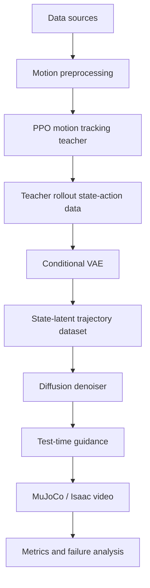

# Full Pipeline Mermaid Source

```mermaid
flowchart TD
    A[Data sources] --> B[Motion preprocessing]
    B --> C[PPO motion tracking teacher]
    C --> D[Teacher rollout state-action data]
    D --> E[Conditional VAE]
    E --> F[State-latent trajectory dataset]
    F --> G[Diffusion denoiser]
    G --> H[Test-time guidance]
    H --> I[MuJoCo / Isaac video]
    I --> J[Metrics and failure analysis]
```
